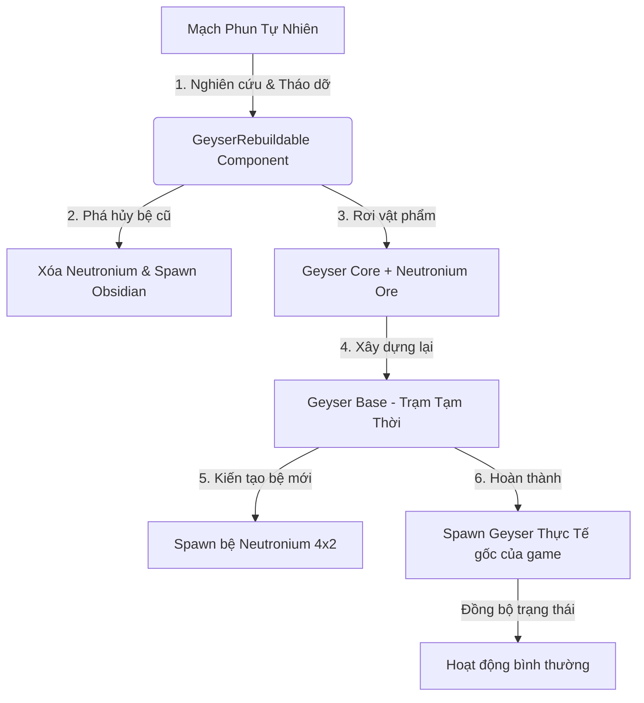

# Báo Cáo Nghiên Cứu: Giải Pháp Di Chuyển Mạch Phun (Geysers/Volcanoes) Trong Oxygen Not Included

- **ID**: Analysis-MoveGeyser
- **Type**: Technical Spike & Architectural Design
- **Status**: Completed
- **Created**: 2026-05-31

---

## 1. Tóm Tắt Điều Hành (Executive Summary)

Mạch phun (Geysers, Vents, Volcanoes) và bệ đá siêu cứng Neutronium (Unobtanium) đi kèm là những thực thể cố định (immovable) mặc định trong game *Oxygen Not Included* (ONI). Điều này giới hạn sự sáng tạo và khả năng tối ưu hóa quy hoạch căn cứ của người chơi. 

Báo cáo này nghiên cứu giải pháp xây dựng một bản mod cho phép **di chuyển các mạch phun** một cách cân bằng về gameplay (lore-friendly) và an toàn về mặt kỹ thuật (không gây lỗi lưới vật lý grid, crash game hay để lại lỗi dữ liệu khi gỡ mod).

Dựa trên việc phân tích sâu hai dự án tham chiếu mã nguồn mở cực kỳ xuất sắc của tác giả *Sanchozz* trong workspace là **`ReBuildableAETN`** (Tháo dỡ và xây dựng lại máy làm lạnh cổ đại AETN) và **`BuildableGeneShuffler`** (Sacrifice Morb để chế tạo Neural Vacillator), chúng tôi đề xuất phương án kiến trúc tối ưu: **Tháo dỡ, thu hồi Lõi Mạch Phun (Geyser Core), dọn dẹp Neutronium cũ và Tái thiết tại vị trí mới**.

---

## 2. Phân Tích Mã Nguồn Tham Chiếu & Cơ Chế Game Lõi (Source-Driven Analysis)

### 2.1. Cơ Chế Tháo Dỡ POI Cổ Đại (`ReBuildableAETN`)
Dự án `ReBuildableAETN` cung cấp giải pháp chuyển hóa một thực thể cố định thành có thể tháo dỡ thông qua cơ chế:
- **Nghiên Cứu Trước Khi Phá Hủy**: Gắn một custom component `MassiveHeatSinkRebuildable` kế thừa `Workable` và `ISidescreenButtonControl` vào prefab của AETN. Component này cung cấp nút bấm "Study" trên giao diện Side Screen.
- **Kích Hoạt Deconstruct**: Sau khi Duplicant hoàn thành việc nghiên cứu, component sẽ chuyển thuộc tính `deconstructable.allowDeconstruction = true`, đồng thời gán kỹ năng yêu cầu để tháo dỡ là `CanDemolish` (phá hủy công trình cổ đại).
- **Spawn Vật Phẩm Core**: Khi tháo dỡ xong, bắt sự kiện `GameHashes.DeconstructComplete` để spawn ra vật phẩm đặc biệt `MassiveHeatSinkCore` làm nguyên liệu tái thiết.
- **Tái Thiết**: Harmony Postfix vào `MassiveHeatSinkConfig` để chuyển `ShowInBuildMenu = true` và bổ sung `MassiveHeatSinkCore` vào danh sách nguyên liệu xây dựng của BuildingDef.

### 2.2. Cơ Chế Spawn & Chuyển Đổi Thực Thể Gốc (`BuildableGeneShuffler`)
Dự án `BuildableGeneShuffler` giải quyết bài toán chế tạo các máy móc đặc biệt không thuộc hệ thống xây dựng thông thường của game:
- **Trạm Xây Dựng Tạm Thời**: Tạo một building tạm thời `BuildableGeneShuffler` cho phép người chơi đặt lệnh xây dựng từ menu.
- **Lưu Trữ Nguyên Liệu Chế Tạo**: Sử dụng `Storage` để gom các nguyên liệu đặc thù (như nước muối Brine) và tạo fetch task để mang sinh vật (Morb) bỏ vào máy.
- **Thay Thế Thực Thể (Spawn & Delete)**: Sau khi hoàn thành công đoạn chuẩn bị bằng đệ tử y tế, thực thi hàm `SpawnGeneShuffler()` để:
  1. Sử dụng `GameUtil.KInstantiate` spawn thực thể game gốc `GeneShuffler` tại vị trí đó.
  2. Tính toán nhiệt độ, khối lượng, mầm bệnh tích lũy từ vật liệu xây dựng và nguyên liệu trong storage để gán sang thực thể mới.
  3. Xóa bỏ hoàn toàn đối tượng xây dựng tạm thời (`gameObject.DeleteObject()`).
  4. Gắn thêm component `BuildedGeneShuffler` vào thực thể mới sinh ra nhằm lưu lại cấu trúc khối lượng nguyên liệu chế tạo ban đầu, cho phép trả lại đầy đủ tài nguyên khi người chơi tháo dỡ về sau.

### 2.3. Khảo Sát Cơ Chế Geyser & Neutronium Trong Game Gốc
- **Thực Thể Geyser**: Mọi mạch phun đều sử dụng component `Geyser` để quản lý chu kỳ hoạt động và `GeyserConfigurator` để cấu hình loại mạch phun (`presetType`).
- **Lưới Chân Bệ Neutronium (4x2)**: 
  - Mạch phun luôn spawn phía trên một bệ Neutronium (Unobtanium) kích thước 4 ô ngang, 2 ô dọc. 
  - Neutronium là một block dạng gạch cứng (Solid Cell). Việc di chuyển Geyser mà không xử lý 8 ô Neutronium này sẽ gây lỗi hiển thị vật lý và phá hỏng cảnh quan map.
  - Game thay đổi cấu trúc lưới đất đá thông qua `SimMessages.ReplaceElement`.

---

## 3. So Sánh Các Phương Án Di Chuyển (Technical Trade-offs)

Chúng tôi đặt lên bàn cân hai phương pháp kỹ thuật chính để di chuyển mạch phun:

| Tiêu Chí So Sánh | Phương Án 1: Tháo Dỡ & Tái Thiết (Rebuildable - Đề Xuất) | Phương Án 2: Di Chuyển Tức Thời (Movable Tool) |
| :--- | :--- | :--- |
| **Cơ Chế Gameplay** | Nghiên cứu mạch phun tự nhiên $\rightarrow$ Tháo dỡ thu hồi Lõi (Core) + Obsidian $\rightarrow$ Xây dựng bệ đỡ và nạp Lõi ở vị trí mới $\rightarrow$ Spawn Geyser mới. | Sử dụng tool hoặc thiết bị "Beacon" quét trực tiếp, Duplicant đến đóng gói mạch phun thành hộp (crate) rồi mang đi đặt lại. |
| **Độ Cân Bằng (Balance)** | **Rất cao**. Đòi hỏi kỹ năng Nghiên cứu thế giới, tốn thời gian tháo dỡ và tài nguyên thép/kim loại tinh chế để xây dựng lại bệ Neutronium mới. | **Thấp**. Cảm giác quá nhanh chóng và dễ dàng giống như một công cụ cheat trừ khi thiết kế khối lượng hộp cực nặng hoặc tốn năng lượng khổng lồ. |
| **Độ Phức Tạp Của Code** | **Trung bình**. Cần tạo 1 thực thể Core duy nhất lưu trữ loại Geyser, 1 Building Base tạm thời, và các Harmony Patch để can thiệp quá trình sinh/xóa. | **Cao**. Phải viết custom tool quét vị trí (`TargetSelectTool`), quản lý cơ chế bế hộp của Duplicant và cập nhật lưới tọa độ tức thời. |
| **Xử Lý Neutronium** | **Hoàn hảo**. Khử bỏ bệ Neutronium cũ thành Obsidian/Đất đá thông thường khi tháo dỡ. Tự động spawn bệ Neutronium mới đồng bộ tại điểm đích khi xây xong. | **Dễ phát sinh lỗi**. Nếu di chuyển tọa độ mạch phun mà không xóa/spawn gạch Neutronium tương ứng, lưới đất đá sẽ bị thủng hoặc đè chồng lên nhau. |
| **Tương Thích Gỡ Mod** | **Cực kỳ an toàn**. Nếu người chơi gỡ mod, các mạch phun đã xây dựng lại vẫn tồn tại vĩnh viễn dưới dạng thực thể Geyser gốc của game, không gây lỗi hỏng file save. | **Rủi ro**. Nếu file save đang lưu trữ thực thể trung gian "Geyser Crate" hoặc "Beacon" đang vận chuyển, gỡ mod chắc chắn gây crash game khi load. |

> [!IMPORTANT]  
> **QUYẾT ĐỊNH THIẾT KẾ**: Lựa chọn **Phương Án 1: Tháo Dỡ & Tái Thiết** làm kiến trúc cốt lõi vì tính đồng bộ lưới vật lý cao nhất, cân bằng lối chơi hoàn hảo, tích hợp tuyệt vời vào chuỗi cung ứng logistics (có thể chở Lõi mạch phun qua tên lửa sang hành tinh khác trong Spaced Out!) và đặc biệt an toàn tuyệt đối với file save.

---

## 4. Thiết Kế Kiến Trúc Hệ Thống (Architectural & Low-Level Design)

Giải pháp tháo dỡ và tái thiết sẽ được hiện thực hóa qua mô hình 4 thành phần chính:



### Bước 1: Patch Tích Hợp Component Nghiên Cứu (`GeyserRebuildable`)
Harmony Patch vào `GeyserGenericConfig.CreatePrefab` (hoặc `OnPrefabInit`) để bổ sung component custom:
- Component `GeyserRebuildable : Workable, ISidescreenButtonControl` sẽ hiển thị nút "Study Geyser" trên Side Screen.
- Thuộc tính `deconstructable.allowDeconstruction` mặc định đặt là `false`.
- Sau khi Duplicant có kỹ năng Research hoàn tất công việc nghiên cứu (tốn $3600$ giây làm việc), set `studied = true` và mở khóa `deconstructable.allowDeconstruction = true`.
- Đặt kỹ năng tháo dỡ yêu cầu: `Db.Get().SkillPerks.CanDemolish.Id` (Phá hủy tàn tích cổ đại).

### Bước 2: Logic Tháo Dỡ & Dọn Dẹp Neutronium Cũ
Khi người chơi phát lệnh tháo dỡ mạch phun thành công (`GameHashes.DeconstructComplete`):
1. **Xóa thực thể Geyser**: Tự động gọi `gameObject.DeleteObject()`.
2. **Dọn dẹp bệ Neutronium chân đế**:
   - Xác định tọa độ góc đáy của Geyser (ví dụ: `Grid.PosToCell(this)`).
   - Lọc ra 8 ô (4x2) nằm dưới chân mạch phun vốn là gạch Neutronium (`SimHashes.Unobtanium`).
   - Gửi tín hiệu SimMessage để chuyển đổi 8 ô này thành đá Obsidian hoặc đất đá bình thường của biome đó nhằm giữ vững cấu trúc nền móng bản đồ, tránh tạo khoảng không chân không đột ngột:
     ```csharp
     SimMessages.ReplaceElement(cell, SimHashes.Obsidian, CellEventLogger.Instance.DebugTool, mass: 1000f, temperature: 293f);
     ```
3. **Rơi Lõi Mạch Phun và Quặng**:
   - Spawn ra 1 vật phẩm đặc chủng: **Lõi Mạch Phun (Geyser Core)**.
   - Component `GeyserCore` gắn trên vật phẩm sẽ lưu trữ thuộc tính `[Serialize] public string geyserTypeID` (được sao chép từ `presetType` của mạch phun cũ, ví dụ: `cool_steam_vent`, `slush_salt_water`,...).
   - Rớt thêm một lượng nhỏ quặng Neutronium đặc biệt (`NeutroniumOre`) phục vụ cho công thức xây dựng bệ đỡ mới.

### Bước 3: Định Nghĩa Vật Phẩm Lõi Mạch Phun (`GeyserCoreConfig`)
Để tối ưu hóa hiệu năng và dung lượng code, chúng ta **chỉ tạo duy nhất một Prefab thực thể `GeyserCore`**.
- Lõi này sẽ sử dụng cơ chế tương tự như trứng sinh vật hoặc space artifact để lưu trữ cấu hình.
- Component `GeyserCore` sẽ ghi lại chính xác loại mạch phun.
- Harmony Postfix vào phần hiển thị tên và mô tả của Lõi để cập nhật động theo loại mạch nạp bên trong (ví dụ: hiển thị *"Lõi Mạch Nước Lạnh"* nếu `geyserTypeID == "cool_steam_vent"`).

### Bước 4: Trạm Xây Dựng Tái Thiết Tạm Thời (`GeyserBaseConfig`)
Người chơi sẽ xây dựng một công trình tạm thời có tên `GeyserBase` (kích thước 4x4):
- **Menu xuất hiện**: Menu Utilities hoặc Refinement.
- **Công thức xây dựng**: Yêu cầu Thép / Kim loại tinh chế + **1 Lõi Mạch Phun (Geyser Core)**.
- **Kiến trúc tạm thời**: Kế thừa lớp `StateMachineComponent<GeyserBase.StatesInstance>` tương tự như `BuildableGeneShuffler`.
- **Hành động Tái thiết**:
  - Khi đệ tử hoàn thành công đoạn xây dựng `GeyserBase`:
    1. Xác định tọa độ 8 ô chân đế bên dưới công trình.
    2. Sử dụng `SimMessages.ReplaceElement` biến đổi 8 ô này thành gạch Neutronium cứng (`SimHashes.Unobtanium`) để làm bệ đỡ vững chắc cho mạch phun mới.
    3. Trích xuất thuộc tính `geyserTypeID` từ Lõi Mạch Phun nằm trong storage của `GeyserBase`.
    4. Spawn thực thể Geyser gốc tương ứng thông qua `GameUtil.KInstantiate(Assets.GetPrefab(geyserTypeID), position)`.
    5. Thiết lập cấu hình mạch phun bằng cách gọi `GeyserConfigurator` để nạp `presetType`.
    6. Kích hoạt thực thể mới: `SetActive(true)`.
    7. Xóa bỏ hoàn toàn trạm xây dựng tạm thời `GeyserBase` (`gameObject.DeleteObject()`).

---

## 5. Đánh Giá Rủi Ro & Giải Pháp Khắc Phục (Risk Assessment & Mitigation)

1. **Rủi ro sụt giảm nhiệt độ/áp suất đột ngột khi phá hủy bệ Neutronium**:
   - *Nguyên nhân*: Neutronium có độ dẫn nhiệt bằng 0. Khi biến nó thành Obsidian hoặc chân không, nhiệt độ cực cao từ các túi magma hoặc khí nóng lân cận có thể truyền đi gây nứt vỡ môi trường.
   - *Khắc phục*: Khi phá hủy bệ Neutronium cũ, thiết lập nhiệt độ của gạch Obsidian mới sinh ra tương đương với nhiệt độ trung bình của môi trường xung quanh (khoảng $293\text{ K}$) để tránh sốc nhiệt.

2. **Khả năng crash game khi gỡ cài đặt mod (Safe Uninstall)**:
   - *Nguyên nhân*: Nếu người chơi xây dựng lại Geyser, rồi sau đó gỡ mod. Nếu Geyser đó chứa component custom của mod hoặc nếu bệ Neutronium được coi là thực thể của mod, game sẽ crash khi load save.
   - *Khắc phục*: Thực thể Geyser sinh ra tại vị trí mới là **thực thể game gốc hoàn toàn** (`GeyserGenericConfig` gốc). Bệ Neutronium mới sinh ra cũng là gạch Unobtanium gốc của game. Khi gỡ mod, game chỉ đơn giản là bỏ qua component nghiên cứu `GeyserRebuildable` không tìm thấy, các mạch phun đã di chuyển vẫn hoạt động và tồn tại bình thường trên bệ Neutronium mà không gây ra bất kỳ lỗi file save nào! Đây là ưu thế tuyệt đối của giải pháp Rebuildable.

3. **Vấn đề đồng bộ chu kỳ hoạt động (Eruption Cycles)**:
   - *Nguyên nhân*: Khi spawn mạch phun mới, game mặc định sẽ tính toán lại ngẫu nhiên (randomize) chu kỳ phun, lượng phun trung bình và thời gian hoạt động tiếp theo. Người chơi có thể lạm dụng việc tháo dỡ - xây lại liên tục để "reroll" ra chỉ số phun cực đại (Exploit).
   - *Khắc phục*:
     - **Giải pháp A**: Chấp nhận reroll như một tính năng tốn tài nguyên (mỗi lần tháo dỡ/xây lại tốn rất nhiều thời gian và thép).
     - **Giải pháp B (Tối ưu)**: Lưu trữ các thông số chu kỳ gốc (`activePercent`, `activePeriod`, `emitRate`, `iterationPercent`, `iterationPeriod`) vào component `GeyserCore` khi tháo dỡ, sau đó nạp lại các thông số này vào thực thể Geyser mới sinh ra thông qua Harmony Patch can thiệp hàm sinh thông số của `Geyser`.

---

## 6. Kế Hoạch Hành Động Chi Tiết (Actionable Task List)

Để sẵn sàng triển khai mã nguồn, chúng tôi phân rã công việc thành các đầu mục hành động nguyên tử sau:

### Giai Đoạn 1: Phát Triển Vật Phẩm Lõi & Patches Nền Tảng
- [ ] **Task 1.1**: Định nghĩa class `GeyserCoreConfig` kế thừa `IEntityConfig` để tạo vật phẩm Lõi Mạch Phun từ chất liệu Neutronium (lưu trữ thuộc tính cấu hình `geyserTypeID`).
- [ ] **Task 1.2**: Harmony Patch can thiệp vào `Localization` để tự động khởi tạo chuỗi ngôn ngữ dịch thuật Tiếng Việt và Tiếng Anh cho Lõi Mạch Phun.
- [ ] **Task 1.3**: Harmony Patch vào màn hình hiển thị tên vật phẩm để cập nhật tên Lõi động dựa trên loại mạch phun chứa bên trong.

### Giai Đoạn 2: Xây Dựng Logic Nghiên Cứu & Tháo Dỡ
- [ ] **Task 2.1**: Viết component `GeyserRebuildable` kế thừa `Workable` và `ISidescreenButtonControl` tạo cơ chế nghiên cứu trên Side Screen.
- [ ] **Task 2.2**: Harmony Patch can thiệp `GeyserGenericConfig` để tự động đính kèm component `GeyserRebuildable` vào mọi thực thể Geyser tự nhiên khi nạp game.
- [ ] **Task 2.3**: Phát triển logic dọn dẹp bệ Neutronium chân đế cũ (sử dụng `SimMessages.ReplaceElement` biến Unobtanium thành Obsidian) và spawn `GeyserCore` chứa thông số chu kỳ gốc khi có sự kiện `DeconstructComplete`.

### Giai Đoạn 3: Phát Triển Trạm Tái Thiết Tạm Thời
- [ ] **Task 3.1**: Định nghĩa cấu hình `GeyserBaseConfig` cho trạm xây dựng tạm thời, thiết lập kích thước 4x4, công thức xây dựng yêu cầu 1 `GeyserCore` và 400kg Thép.
- [ ] **Task 3.2**: Thiết lập máy trạng thái `GeyserBaseStateMachine` để quản lý các bước: Chờ nạp lõi $\rightarrow$ Đệ tử kỹ thuật chế tác $\rightarrow$ Kích hoạt tái thiết.
- [ ] **Task 3.3**: Hoàn thiện logic hàm `SpawnGeyser()` trong `GeyserBase`: biến đổi 8 ô chân đế thành Unobtanium, spawn thực thể Geyser gốc, đồng bộ thông số chu kỳ cũ và xóa bỏ `GeyserBase`.

---
*Báo cáo nghiên cứu đã hoàn tất và sẵn sàng để chuyển giao sang giai đoạn lập kế hoạch chi tiết `/02-plan` khi có sự phê duyệt từ người dùng.*
